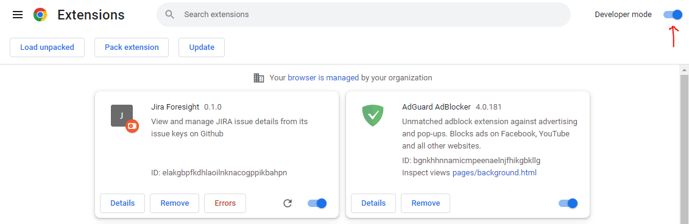
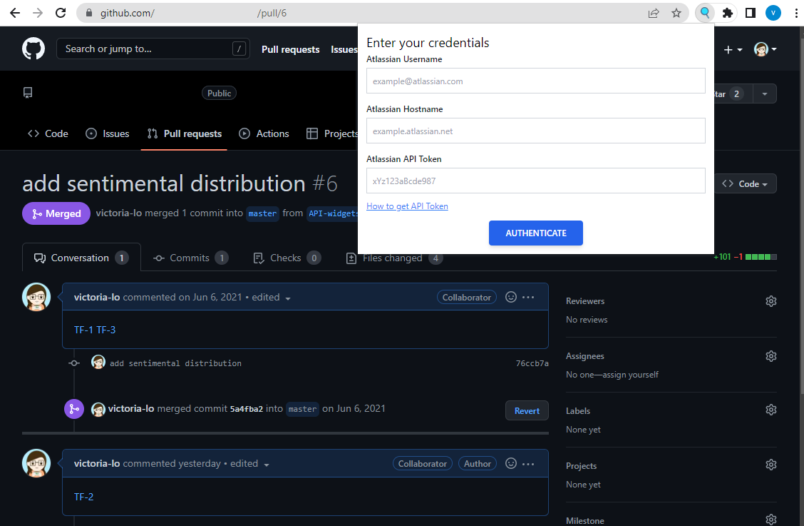
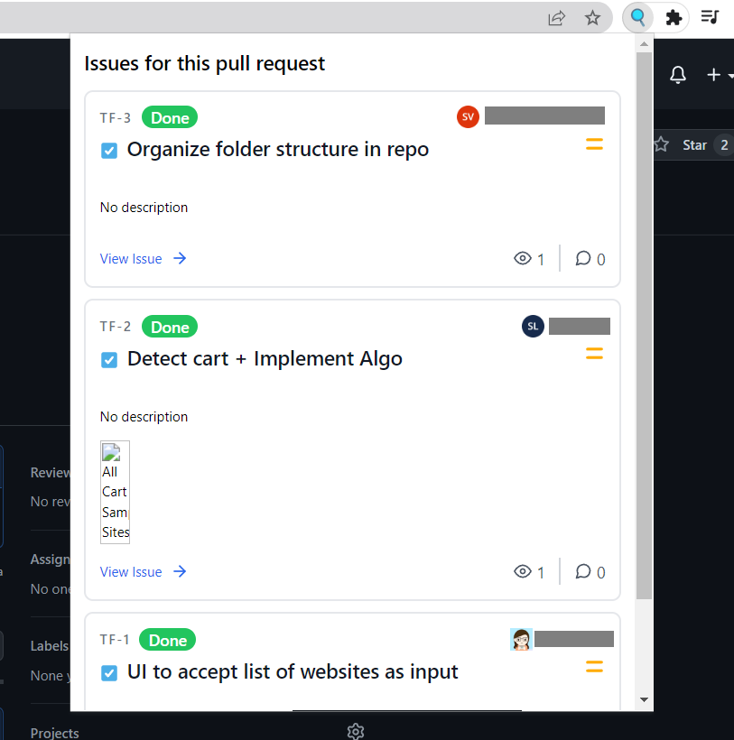
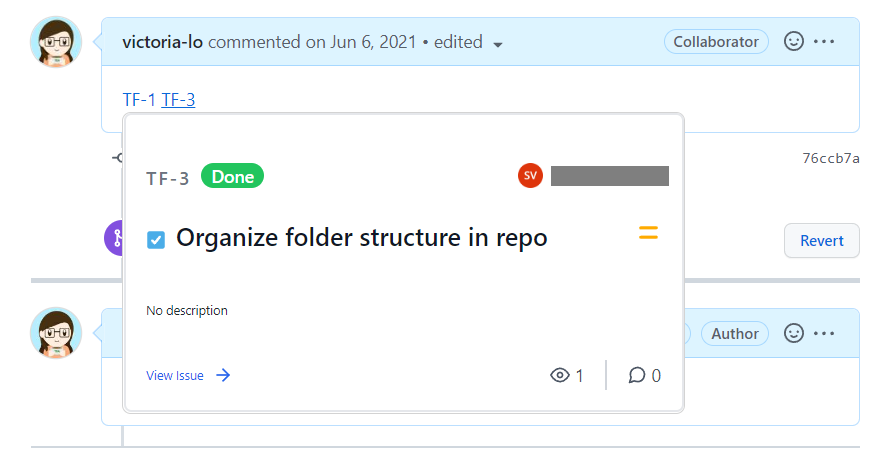

<div id="top"></div>

<!-- PROJECT DESCRIPTION-->
<div align="center">
<h2 align="center">JIRA Foresight</h2>

  <p align="center"></p>
    <a href="https://github.com/steffy-lo">Report Bug</a>
    ·
    <a href="https://github.com/steffy-lo">Request Feature</a>

</div>

<!-- TABLE OF CONTENTS -->

### Table of Contents

<details>
  <summary>Click to Expand</summary>
  <ol>
    <li>
      <a href="#about-the-project">About The Project</a>
      <ul>
        <li><a href="#built-with">Built With</a></li>
        <li><a href="#features">Features</a></li>
      </ul>
    </li>
    <li>
      <a href="#getting-started">Getting Started</a>
      <ul>
        <li><a href="#prerequisites">Prerequisites</a></li>
        <li><a href="#installation">Installation</a></li>
        <li><a href="#usage">How to Use</a></li>
      </ul>
    </li>
    <li><a href="#contact">Contact</a></li>
  </ol>
</details>

<!-- ABOUT THE PROJECT -->
<div id="about-the-project"></div>

## About The Project

JIRA Foresight is a Chrome extension to makes it convenient to view PR tickets without having to open a new tab or go to the JIRA link. You can see the ticket's title, PR number, assignee, description, watchers, comments and more.

<p align="right">(<a href="#top">back to top</a>)</p>

<div id="built-with"></div>

### Built With

- [Node.js](https://nodejs.org/en/about/)
- [HTML 5](https://dev.w3.org/html5/html-author/)
- [Tailwind CSS](https://tailwindcss.com/)
- [Parcel](https://parceljs.org/)

<p align="right">(<a href="#top">back to top</a>)</p>

<div id="features"></div>

<!-- FEATURES -->

### Features

- Shows JIRA issues, links and description on a PR page on GitHub
- Shows JIRA issue and description when hovering on a PR number


<p align="right">(<a href="#top">back to top</a>)</p>


<div id="getting-started"></div>

<!-- GETTING STARTED -->

## Getting Started

To use this extension in your local machine, you must have the following prerequisites.

<div id="prerequisites"></div>

### Prerequisites

- Node & npm

> Download the latest Node and npm from their official [website](https://nodejs.org/en/download/).

- JIRA/Atlassian account

> Create one on their [website](https://www.atlassian.com/software/jira).

- Google Chrome browser

<div id="installation"></div>

### Installation

1. Clone the repo
   ```sh
   git clone https://github.paypal.com/gps-asia/btplayground.git
   ```
2. Install NPM packages in both root and server folders
   ```sh
   npm install
   cd server
   npm install
   ```
3. In the `server` folder, start the server with the following command
   ```sh
   npm run dev
   ```
4. Bundle the packages in the root folder with:
   ```sh
   npm run watch
   ```
5. Open Chrome browser and go to `chrome://extensions/`
6. Toggle on the **Developer mode** in the top-right corner. Then select **Load unpacked**, select the project's `dist` folder.


<p align="right">(<a href="#top">back to top</a>)</p>

<div id="usage"></div>

### How to Use

After following installation instructions, go to a GitHub PR page, click on the extension icon and enter creds.


Then, you will see all the PRs in the extension.



Hover on the PR ticket number to view the details individually.



<p align="right">(<a href="#top">back to top</a>)</p>


<div id="contact"></div>

<!-- CONTACT -->

## Contact Us

- Steffy Lo
- [Victoria Lo](https://lo-victoria.com)


<p align="right">(<a href="#top">back to top</a>)</p>

